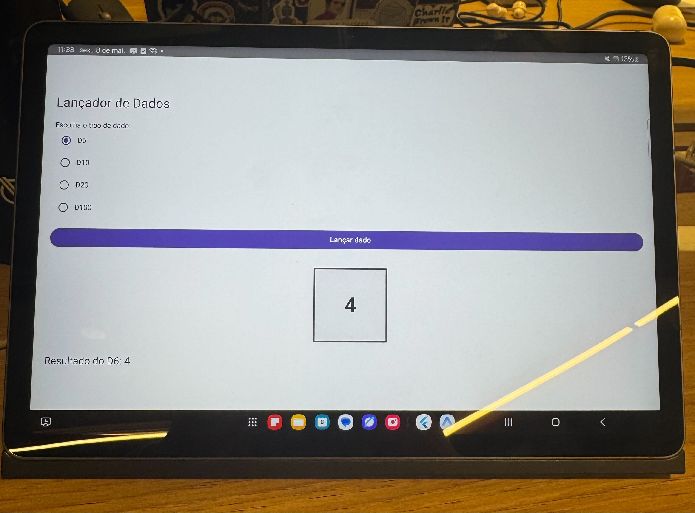
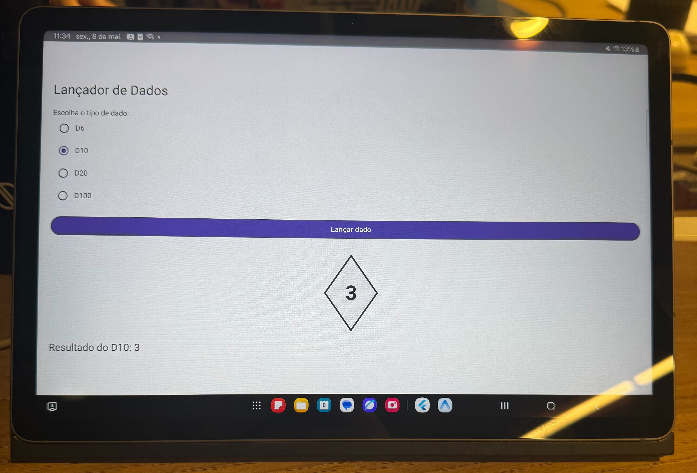
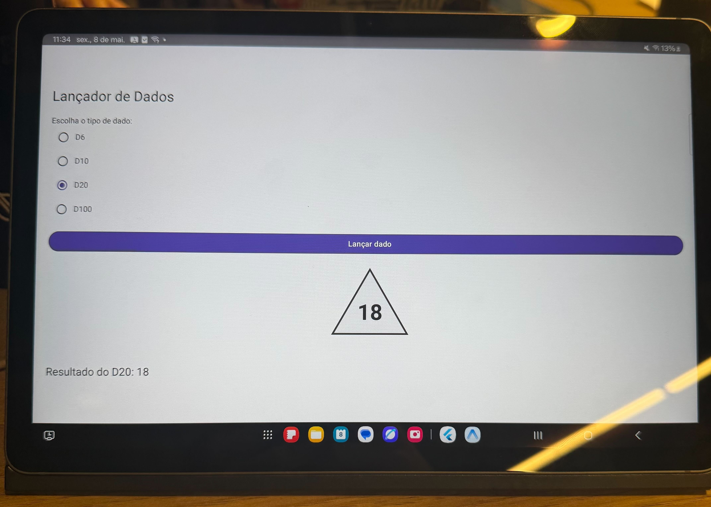
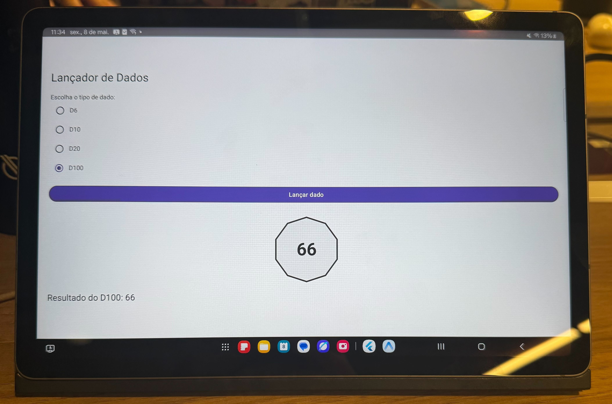

# Relatório de Atividade Ponderada 1 — Módulo 10
**Alunos:** Cecília Galvão e Pablo Azevedo
**Disciplina:** Programação — Prof. Murilo Zanini
**Data:** 08 de maio de 2025

## Introdução

Esta atividade foi proposta pelo professor Murilo Zanini no dia 08/05, na aula de programação do Módulo 10. O ponto de partida era uma aplicação Android chamada **Lançador de Dados**, disponibilizada via repositório base no GitHub, que já vinha com uma tela funcional para lançar um dado D6 — mas com um erro lógico embutido de propósito: o dado não retornava corretamente valores entre 1 e 6.

A tarefa era executar o app, identificar o comportamento incorreto, corrigir o bug e depois expandir a aplicação para suportar dados D10, D20 e D100, com interface de seleção e exibição correta do resultado. Para quem quisesse a nota máxima, o desafio extra era implementar representações visuais distintas para cada tipo de dado.

Este relatório não é uma lista de passos certos. É um diário honesto de tudo que tentamos, erramos, entendemos errado e eventualmente acertamos — porque achamos que isso representa melhor o que de fato aprendemos do que uma solução apresentada já pronta e polida.


## 1. Antes de escrever qualquer linha: o problema de rodar o projeto

Antes de qualquer bug de lógica, a primeira dificuldade foi bem mais básica: fazer o projeto rodar no Android Studio.

Ao clonar o repositório e abrir no Android Studio, a sincronização do Gradle falhou na primeira tentativa. A mensagem de erro apontava para incompatibilidade de versão do Kotlin configurada no `build.gradle.kts` com a versão instalada localmente. Levamos um tempo até entender que o problema não era o código em si, mas o ambiente — e que a solução era deixar o próprio Android Studio atualizar o Gradle plugin em vez de tentar ajustar manualmente.

Depois disso, ao tentar subir o emulador, ele não inicializava. O Android Studio mostrava um aviso de que a aceleração de hardware (HAXM) não estava ativa. Precisamos entrar nas configurações do AVD Manager, recriar o emulador com uma imagem de sistema diferente (trocamos de x86 para x86_64) e só então ele subiu normalmente. Nada disso estava no enunciado, mas foi parte real do processo.

Com o app finalmente rodando no emulador, pudemos começar de verdade.

## 2. Procurando o código no lugar errado

A segunda dificuldade foi encontrar onde a interface estava definida — e aqui a gente perdeu facilmente uns trinta minutos olhando para o lugar errado.

Em projetos Android mais antigos, a tela é descrita em arquivos XML dentro de `res/layout/`. Essa era a nossa referência, então nossa primeira aposta foi abrir a pasta `app/src/main/res/` e vasculhar tudo que tinha lá:

- `res/values/strings.xml` — só continha o nome do app.
- `res/values/themes.xml` e `res/values/colors.xml` — apenas configurações visuais de tema.
- `res/drawable/` — só os ícones do launcher.

Nenhum `activity_main.xml`. Nenhum `Button`. Nenhum `TextView`. A Cecília chegou a comentar em voz alta "será que o XML foi deletado?", e o Pablo abriu o `AndroidManifest.xml` convicto de que o layout estaria referenciado lá — mas o manifest só declarava a `MainActivity` sem mencionar nenhum arquivo de layout.

Foi só quando voltamos ao `MainActivity.kt`, em `app/src/main/java/carvalho/zanini/ponderada1/`, e lemos o arquivo com mais atenção que entendemos o que estava acontecendo: o projeto usa **Jetpack Compose**. Não existe arquivo XML de layout porque a interface inteira é construída em Kotlin, dentro de funções anotadas com `@Composable`. O `onCreate` da activity chama `setContent { LancadorDeDadosApp() }`, e é essa função `LancadorDeDadosApp()` que define toda a tela.

Essa foi a primeira lição real da atividade, antes mesmo de falar em bug: em projetos Compose, "onde fica a tela" não é um arquivo separado — é uma função Kotlin dentro do próprio código.

## 3. Identificando e corrigindo o bug do D6

Com a função correta em mãos, o bug ficou imediatamente visível. A linha responsável pelo sorteio era:

```kotlin
val valorSorteado = when (dadoSelecionado) {
    "D6" -> Random.nextInt(6)
    else -> 0
}
```

Rodamos o app no emulador várias vezes seguidas e registramos os resultados. Em quase metade das jogadas saiu `0`. Consultando a documentação do Kotlin, confirmamos o problema: `Random.nextInt(n)` retorna um inteiro no intervalo **0 até n-1**, ou seja, para `nextInt(6)` os valores possíveis são 0, 1, 2, 3, 4 e 5. O valor 6 nunca saía, e o valor 0 — que não existe em nenhum dado físico — aparecia com a mesma frequência que qualquer outro.

A correção parecia simples, mas a gente ainda errou uma vez antes de acertar.

**Primeira tentativa (errada):** o Pablo trocou para `Random.nextInt(7)`. Isso resolveu o problema do 6 nunca aparecer, mas o 0 continuava sendo um resultado possível. O intervalo agora era 0..6, e um dado D6 real nunca mostra 0.

**Segunda tentativa (correta):** a forma certa usa dois argumentos — `Random.nextInt(from, until)` — que define um intervalo semiaberto `[from, until)`. Para o D6, a chamada correta é `Random.nextInt(1, 7)`, que gera valores de 1 a 6 inclusive. O `1` garante que o menor valor possível seja 1, e o `7` no limite superior (exclusivo) garante que o maior valor possível seja 6.


## 4. Expandindo para D10, D20 e D100

Com o D6 funcionando, partimos para adicionar os outros dados. Aqui descobrimos que havia dois lugares para mexer — e na primeira passagem esquecemos um deles completamente.

**Mudança 1 — a lista de tipos de dado:** a variável `dados` era `listOf("D6")`, com apenas um item. O `forEach` que constrói os `RadioButton` na tela dependia dessa lista, então só o D6 aparecia como opção. Adicionamos os demais: `listOf("D6", "D10", "D20", "D100")`. Os três botões apareceram na interface imediatamente.

Animados, clicamos em D20, clicamos em Lançar... e saiu `0`.

**Mudança 2 — o bloco `when` do sorteio:** o `when` que gerava o número aleatório só tinha um caso, `"D6"`, e todo o resto caía no `else -> 0`. Adicionar os tipos na lista não adicionou o comportamento — a lógica ficou para trás. Voltamos e completamos o `when`:

```kotlin
val valorSorteado = when (dadoSelecionado) {
    "D6"   -> Random.nextInt(1, 7)
    "D10"  -> Random.nextInt(1, 11)
    "D20"  -> Random.nextInt(1, 21)
    "D100" -> Random.nextInt(1, 101)
    else   -> 0
}
```

A lógica por trás dos números segue sempre a mesma regra: como `Random.nextInt(from, until)` usa limite superior exclusivo, para um dado de N faces a chamada correta é sempre `Random.nextInt(1, N + 1)`. Somamos 1 no limite de cima para compensar o fato de ele ser exclusivo.

Para confirmar que estava certo, rodamos o app repetidamente para cada tipo de dado, observando três coisas: o mínimo eventualmente chegava a 1, o máximo eventualmente chegava a N, e os valores 0 e N+1 nunca apareciam. Não é um teste automatizado, mas foi suficiente para ter confiança.

A lição que ficou aqui foi clara: estado e interface são coisas separadas em Compose. Mudar a lista visual não muda a lógica — são dois lugares distintos no código, e os dois precisam ser atualizados juntos.


## 5. Estado em Compose: a parte que mais confundiu

Em determinado momento precisávamos que o resultado do sorteio aparecesse na tela depois do clique. Nossa primeira tentativa foi declarar uma variável Kotlin comum:

```kotlin
var resultado = "Clique no botão para lançar o dado"
```

O código compilava sem erro. Mas ao clicar no botão, o texto na tela não mudava absolutamente nada. Ficamos um bom tempo testando se o `onClick` estava sendo chamado (estava), se o valor da variável mudava (mudava), mas a tela permanecia estática.

Pesquisando, entendemos o que estava acontecendo: funções `@Composable` são reexecutadas pelo Compose automaticamente quando o estado muda, mas o Compose só detecta essa mudança se o valor estiver armazenado em um `mutableStateOf`. Uma variável Kotlin comum é invisível para o sistema de recomposição — ela muda no código, mas o Compose não sabe disso e não redesenha a tela.

A forma correta é:

```kotlin
var resultado by remember { mutableStateOf("Clique no botão...") }
```

O `mutableStateOf` cria um objeto observável, e o `remember` garante que ele sobreviva às recomposições sem ser recriado do zero a cada redesenho. Com isso, qualquer alteração no valor dispara automaticamente uma nova execução da função e a tela se atualiza.

Foi o ponto da atividade em que mais sentimos que estávamos aprendendo algo genuinamente novo — não apenas corrigindo uma linha, mas entendendo um modelo mental diferente de como a interface funciona.

## 6. [IR ALÉM] — Faces visuais por tipo de dado

Essa foi a parte que mais passou por versões diferentes, e vale contar cada uma.

**Versão 1 — imagens PNG.** A ideia inicial era usar assets de imagem, uma por face do D6 e ícones representativos para os demais dados. Esbarramos em dois problemas: não encontramos um conjunto de imagens com licença aberta e estilo visual consistente entre si para todos os quatro tipos de dado, e a ideia de ter 100 imagens para o D100 não fazia nenhum sentido prático. Descartamos.

**Versão 2 — caracteres Unicode e emojis.** Recuamos para algo mais simples: usar os caracteres ⚀ ⚁ ⚂ ⚃ ⚄ ⚅ para o D6 e emojis genéricos para os demais. Funcionava, compilava, testamos. Mas a sensação era de que o "dado" era na verdade apenas uma fonte de texto, não uma representação real. Seguimos temporariamente com essa versão enquanto pensávamos em algo melhor.

**Versão 3 — Canvas com `drawRect` e `drawPath`** *(versão final)*. Ao descobrir que o Compose tem um composable `Canvas` próprio com acesso a uma `DrawScope`, percebemos que dava para desenhar as silhuetas dos dados diretamente em código, sem depender de imagens ou fontes externas. Foi o momento em que a atividade deixou de ser sobre consertar o `Random` e virou um exercício de gráficos 2D.

A regra que adotamos foi simples: o D6, sendo o único com silhueta retangular, usa `drawRect`. Os demais usam `drawPath` com formas geométricas distintas — losango para o D10, triângulo equilátero para o D20, e decágono regular calculado trigonometricamente para o D100. Em todos os casos, dois comandos de desenho são executados em sequência: um para o preenchimento e outro com `style = Stroke(...)` para o contorno.

Para exibir o número sorteado sobre a forma, tentamos primeiro usar `drawText` diretamente dentro do `DrawScope` do Canvas — mas isso exigia um `TextMeasurer` e cálculo manual de posição em pixels para centralizar. A alternativa foi mais elegante: envolvemos o `Canvas` e o `Text` dentro de um `Box` com `contentAlignment = Alignment.Center`. O `Box` empilha seus filhos no eixo Z na ordem de declaração, então o Canvas fica embaixo e o texto fica sobre ele, centralizado automaticamente pelo sistema de layout do Compose.

Dois tropeços durante essa etapa merecem registro honesto. No D20, esquecemos o `path.close()` na primeira tentativa e o triângulo apareceu sem a base — três traços soltos que pareciam uma letra V deitada. E ao tentar usar `drawText` no Canvas, percebemos que a centralização manual em pixels era muito mais trabalhosa do que simplesmente usar o `Box` com `Text`, que herda todo o sistema de alinhamento do Compose de graça.

**Imagem 1 — Face visual do dado D6**



**Imagem 2 — Face visual do dado D10**



**Imagem 3 — Face visual do dado D20**



**Imagem 4 — Face visual do dado D100**




## 7. O que tentamos e não conseguimos entregar

Para registrar com sinceridade as coisas que ficaram pelo caminho:

**Animação de rolagem do dado.** Tentamos usar `animate*AsState` para simular o dado girando antes de parar no valor final. A animação funcionou parcialmente, mas introduziu um problema de sincronização: em alguns casos o valor exibido durante a animação não correspondia ao valor que seria sorteado ao final. Desligamos completamente para não comprometer a corretude do resultado exibido. Fica como próximo passo quando entendermos melhor o ciclo de vida das animações em Compose.

**`SegmentedButton` no lugar dos `RadioButton`.** Visualmente seria mais elegante para a seleção de tipo de dado. O problema é que o componente exige uma versão de Material 3 mais recente do que a configurada no `build.gradle.kts` do projeto base, e a tentativa de atualizar abriu uma cadeia de warnings e incompatibilidades que preferimos não enfrentar nesta entrega.

**Histórico das últimas jogadas.** A ideia era manter uma lista com os últimos N resultados exibida abaixo do dado, usando um `LazyColumn`. Conseguimos fazer compilar, mas o layout ficou apertado em telas menores e o conteúdo ficava sendo cortado. Preferimos não entregar algo que degradava a experiência visual.

## Conclusão

A atividade do dia 08/05, proposta pelo professor Murilo Zanini, começou com dificuldades que nem eram sobre código: fazer o Gradle sincronizar, entender por que o emulador não inicializava, e descobrir que a interface não estava onde esperávamos. Antes de encontrar o bug, já tínhamos aprendido que projetos Compose não têm arquivo XML de layout — e isso por si só já foi uma virada de chave na nossa forma de entender a estrutura de um projeto Android moderno.

O bug em si, uma única linha com `Random.nextInt(6)` no lugar de `Random.nextInt(1, 7)`, levou a entender com precisão como funcionam intervalos semiabertos em Kotlin, e ainda nos fez errar mais uma vez antes de acertar — trocamos primeiro para `nextInt(7)` e só depois chegamos à forma correta com dois argumentos. A expansão para D10, D20 e D100 ensinou que UI e lógica precisam ser atualizadas juntas, e o sistema de estado do Compose nos forçou a entender por que `mutableStateOf` existe e por que uma variável comum não é suficiente.

O ir além com o Canvas foi o trecho mais trabalhoso e também o mais recompensador: saímos de emojis colados em texto para formas geométricas desenhadas com `drawRect` e `drawPath`, entendendo trigonometria básica aplicada a vértices e descobrindo que o `Box` do Compose resolve elegantemente o problema de sobrepor texto sobre um desenho.

No final, um bug de uma linha rendeu muito mais aprendizado do que esperávamos quando abrimos o repositório pela primeira vez.
